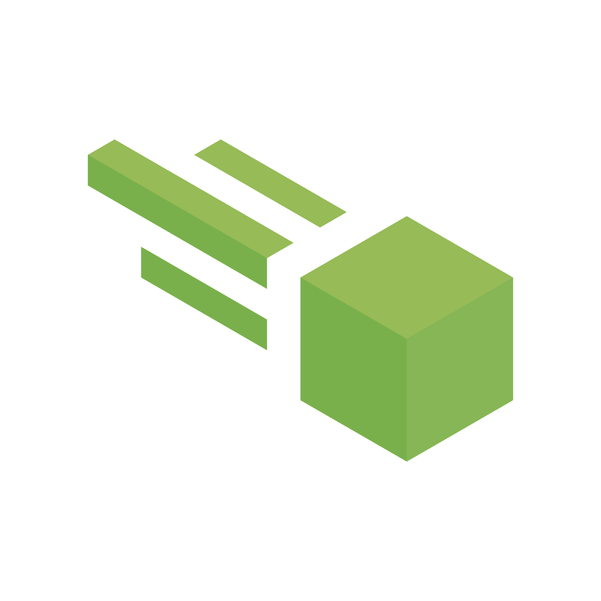

<h1 align="center">Meteor Lite</h1>

A Minecraft Fabric Utility Mod framework.

This is **NOT** designed to be a "Ghost Client" or "hacked client" but purely just **meteor client without the meteor modules**, and **without the commands system** which make using the original considered hacking. 
You can still add modules via addons, but "Meteor Lite" itself **comes with no usable modules** and **expects you** to make your own addon mods if you want to use any.  
For technical users, the only changes from the original "Meteor Client" and "Meteor Lite" are:
- The removal of the chat command system (keybind, hiding prefix setting, sending chat commands)
- Moving all the default modules to the "Meteor" category
- Force disabling any toggle or search for modules in the "Meteor" category
- Rebranding the name/colors of "Meteor Client" to "Meteor Lite".

## Building
- Clone this repository or download it as a zip.
- Run the `./gradlew build` command in the folder.
- Your "Meteor Lite" build will be in the `build/lib` folder.

## Installation
- Build or download the jar file for this project.
- Copy or move it into your game's "mods" folder.
- Optionally repeat this step for any other 3rd-party mods.

## Contributions, Bugs and Suggestions
Any contributions for "Meteor Lite" are acceptable, as long as it's purpose is not to add meteor modules. 
Contributions for Meteor Client in general should be directed here: https://github.com/MeteorDevelopment/meteor-client 
If you wish to donate to Meteor Client for their work visit their [website](https://meteorclient.com/donate), the minimum amount to get donor benefits is €5.  

## Licensing
This project is licensed under the [GNU General Public License v3.0](https://www.gnu.org/licenses/gpl-3.0.en.html). 

If you use **ANY** code from the source:
- You must disclose the source code of your modified work and the source code you took from this project. This means you are not allowed to use code from this project (even partially) in a closed-source and/or obfuscated application.
- You must state clearly and obviously to all end users that you are using code from this project.
- Your application must also be licensed under the same license.

*If you have any other questions, check the Meteor Client [FAQ](https://meteorclient.com/faq) or ask in their [Discord](https://meteorclient.com/discord) server.*
